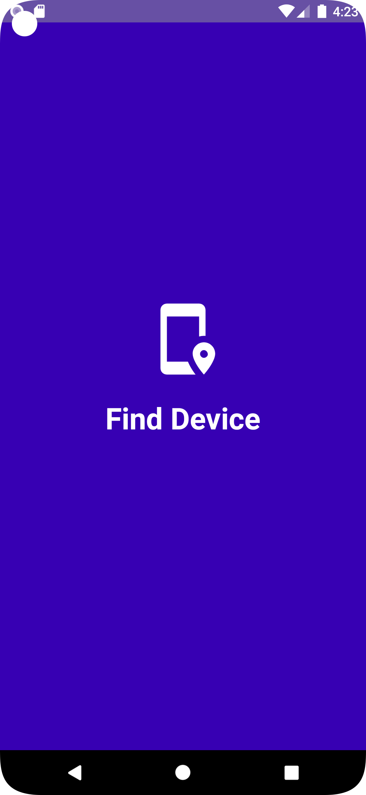
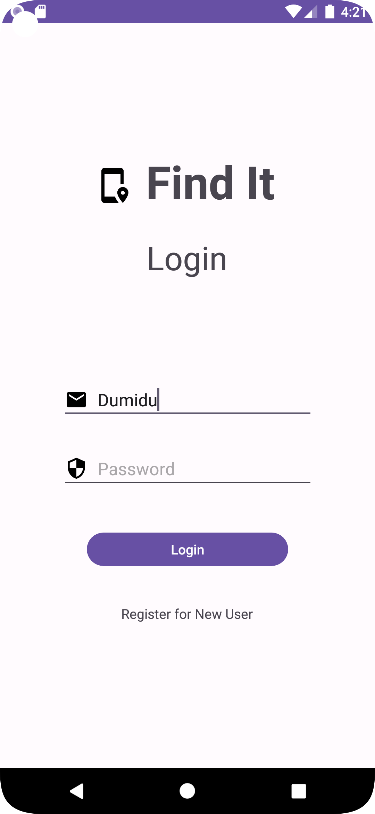
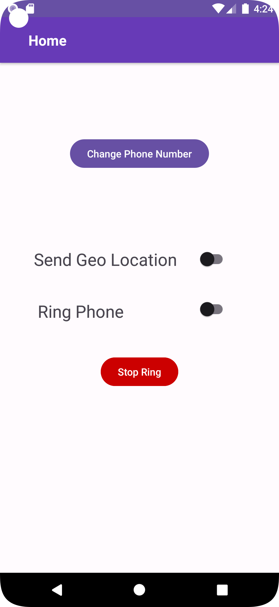

<h2 align="center">
  Lost Phone Finder<br/>
  Android App
</h2>
<div align="center">
    
    
    
</div>

<br/>

<center>

[](https://forthebadge.com)
&nbsp;
[](https://forthebadge.com)
&nbsp;
</center>

## Built With

This is my Lost Phone Finder Android
App, which showcases some of my Android development skills as well as my proficiency in Java. The
app features a multi-page layout, is fully responsive, and is styled with Android's built-in UI
components. It's a comprehensive solution for managing and locating a lost phone, with features
for ringing the phone, changing button colors, and playing ringtones.

This project was built using these technologies.

- Java
- Android Studio
- SQLite

## Features

**🔔 Ring Phone**
**📲 SMS Commands**
**📍 Location Tracking**

## Getting Started

## 🛠 Installation and Setup Instructions

1. **Clone the Repository**: Clone the `findit-android-app` repository from GitHub to your local
   machine. You can do this by running the following command in your terminal:

```bash
git clone https://github.com/DumiduPramith/findIt-android-app.git
```

2. **Open the Project in Android Studio**: Navigate to the directory where you cloned the repository
   and open the `findit-android-app` project in Android Studio.

3. **Run the App**: You can run the app on an Android device or an emulator. To do this, click on
   the `Run` button in the toolbar or press `Shift + F10`.

4. **Build the App**: If you want to generate an APK of your app, you can do this by clicking
   on `Build > Build Bundle(s) / APK(s) > Build APK(s)` in Android Studio.

Please note that you need to have Android Studio and the Android SDK installed on your machine to be
able to build and run the app.

## Github Repo - <a href="https://github.com/DumiduPramith/findIt-android-app.git" target="_blank">https://github.com/DumiduPramith/findIt-android-app.git</a>
